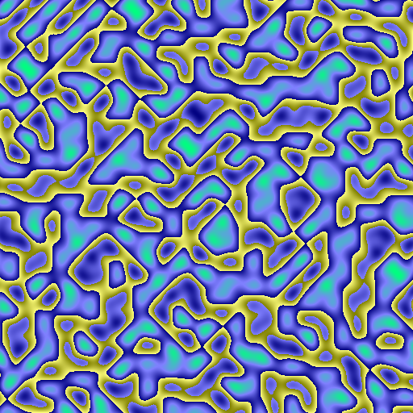

# Algorithmic Abstract Art Generator 

This project is an **algorithmic abstract art generator** that leverages algorithms such as **noise-based methods** (Perlin Noise, Simplex Noise), **fractals** (Mandelbrot, Julia Set, Newton), and the **Game of Life** by Conway. 

Each time the program is closed, the generated image is saved in the `assets` directory.

---

## Table of Contents
- [Requirements](#requirements)
- [Compilation](#compilation)
- [Features](#features)
  - [Noise-Based Algorithms](#noise-based-algorithms)
  - [Fractals](#fractals)
  - [Conway's Game of Life](#conways-game-of-life)
- [Saving Generated Images](#saving-generated-images)
- [FAQ](#faq)
- [Road Map](#roadmap)

---

## Requirements

To run this project, you need:

1. **CMake** (minimum version 3.10) 
2. **Visual Studio 2022**

All other dependencies are already included in the project.

---

## Installation
1. Clone the repository:

   ```bash
   git clone https://github.com/username/abstract-art-generator.git
    ```
---

## Compilation

To compile the project:

1. Run the `compileproject.bat` file.
2. This will generate a Visual Studio solution in the `build` directory.
3. Open the solution in Visual Studio. 
4. In the **Solution Explorer** on the right, select the solution "AbstractArt" and set it as the startup project.
5. Open `main.cc` to experiment with and test the algorithms.

---

## Features

### Noise-Based Algorithms

#### 1. Perlin Noise
Perlin Noise is a type of gradient noise that produces smooth, natural-looking patterns, often used in procedural generation for terrains, clouds, and other textures in computer graphics. It works by interpolating gradients across a grid of points to create a continuous, non-repeating pattern.

- [Perlin Noise Explained](https://en.wikipedia.org/wiki/Perlin_noise)

#### 2. Simplex Noise
Simplex Noise is an improved version of Perlin Noise developed by Ken Perlin. It is computationally more efficient and avoids the visual artifacts sometimes seen in Perlin Noise. Simplex Noise is often used for generating organic textures in 2D and 3D spaces.



**Example Code for Image Generation using Noise Algorithms**:
```cpp
int main() {
    unsigned int width = 512;
    unsigned int height = 512;

    SimplexNoise simplex(width, height);
    std::string fileName;

    std::vector<unsigned char> image_data = simplex.generateImage(fileName);
    
    // SFML Texture
    sf::Texture texture;
    texture.create(width, height);
    texture.update(image_data.data());
    
    // Sprite to show texture
    sf::Sprite sprite(texture);

    // Create window
    sf::RenderWindow window(sf::VideoMode(width, height), "Algorithmic Abstract Art");
    window.setFramerateLimit(60);

    // Show window
    while (window.isOpen()) {
        sf::Event event;
        while (window.pollEvent(event)) {
            if (event.type == sf::Event::Closed)
                window.close();
        }

        window.clear();
        window.draw(sprite);
        window.display();
    }

    if (!std::filesystem::exists("../assets")) {
        std::filesystem::create_directory("../assets");
    }

    // Save image as PNG
    stbi_write_png(fileName.c_str(), width, height, 4, image_data.data(), width * 4);
    std::cout << "Image saved as: " << fileName << std::endl;
    return 0;
}
```

---

### Fractals

Fractals are infinitely complex patterns that are self-similar across different scales. They are created by repeating a simple mathematical formula iteratively. These structures often appear in nature, such as snowflakes, tree branches, and coastlines.

- [Introduction to Fractals](https://fractalfoundation.org/resources/what-are-fractals/)

#### 1. Mandelbrot
The Mandelbrot set is one of the most famous fractals, visualized by iterating a simple formula:  
`z = z² + c`, where `z` and `c` are complex numbers. The result determines whether a point escapes to infinity.

#### 2. Julia Set
The Julia Set is similar to the Mandelbrot Set but focuses on specific complex numbers to produce intricate, mesmerizing patterns.

#### 3. Newton
The Newton fractal visualizes the convergence of complex numbers under Newton's method for solving equations. Different colors represent the roots and their convergence speed.

**Example Code for Image Generation using Fractals**:
```cpp
int main() {
    unsigned int width = 512;
    unsigned int height = 512;

    Mandelbrot mandelbrot(width, height);
    mandelbrot.setZoom(300.0f);
    mandelbrot.setMoveX(-0.5f);
    mandelbrot.setMoveY(0.0f);
    mandelbrot.setMaxIterations(100);
    mandelbrot.setRGBsaturation(0.6f, 0.74f, 0.7f);
    mandelbrot.setScapeRadius(3.0f);

    std::string fileName;
    std::vector<unsigned char> image_data = mandelbrot.generateImage(fileName);

    // SFML Texture
    sf::Texture texture;
    texture.create(width, height);
    texture.update(image_data.data());

    // Sprite to show texture
    sf::Sprite sprite(texture);

    // Create window
    sf::RenderWindow window(sf::VideoMode(width, height), "Algorithmic Abstract Art");
    window.setFramerateLimit(60);

    // Show window
    while (window.isOpen()) {
        sf::Event event;
        while (window.pollEvent(event)) {
            if (event.type == sf::Event::Closed)
                window.close();
        }

        window.clear();
        window.draw(sprite);
        window.display();
    }

    if (!std::filesystem::exists("../assets")) {
        std::filesystem::create_directory("../assets");
    }

    // Save image as PNG
    stbi_write_png(fileName.c_str(), width, height, 4, image_data.data(), width * 4);
    std::cout << "Image saved as: " << fileName << std::endl;
    return 0;
}
```

---

### Conway's Game of Life

Conway's Game of Life is a cellular automaton devised by mathematician John Conway. It simulates the life and death of cells on a grid based on simple rules:
1. Any live cell with 2 or 3 live neighbors survives.
2. Any dead cell with exactly 3 live neighbors becomes a live cell.
3. All other live cells die in the next generation, and all other dead cells remain dead.

This creates fascinating emergent behavior, often resembling biological systems.

- [Conway's Game of Life - Interactive Demo](https://playgameoflife.com/)

**Example Code for Game of Life**:
```cpp
int main() {
    unsigned int width = 512;
    unsigned int height = 512;

    GameOfLife game(width, height);
    std::string fileName;

    // SFML Texture
    sf::Texture texture;
    texture.create(width, height);

    // Sprite to show texture
    sf::Sprite sprite(texture);

    // Create window
    sf::RenderWindow window(sf::VideoMode(width, height), "Algorithmic Abstract Art");
    window.setFramerateLimit(60);

    // Show window
    while (window.isOpen()) {
        sf::Event event;
        while (window.pollEvent(event)) {
            if (event.type == sf::Event::Closed)
                window.close();
        }

        std::vector<unsigned char> image_data = game.generateImage();
        texture.update(image_data.data());
        game.nextGeneration();

        window.clear();
        window.draw(sprite);
        window.display();
    }

    return 0;
}
```

---

## Saving Generated Images

- Each time you close the program, the generated image is automatically saved in the `assets` directory as a PNG file.
- If the `assets` directory does not exist, it will be created during runtime.

---

## FAQ
### How can I modify the resolution of the generated images?
Change the `width` and `height` variables in `main.cc`.

### Can I add my own algorithms?
Yes! Simply create a new class that implements the same interface as the provided algorithms.

---

## Roadmap
- [ ] Add Voronoi diagrams as a generation algorithm.
- [ ] Improve performance for high-resolution fractals.
- [ ] Add a GUI for easier interaction.

---

Enjoy experimenting with **algorithmic abstract art**!
